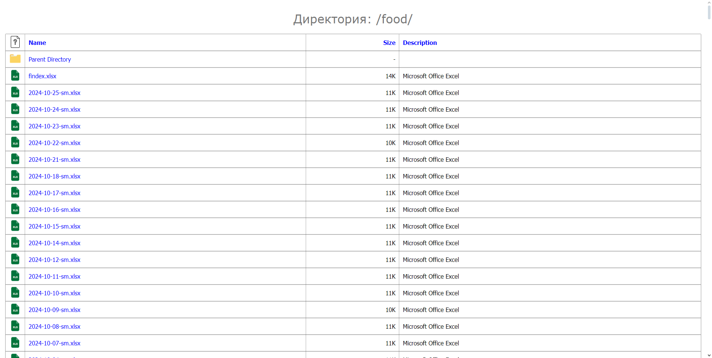
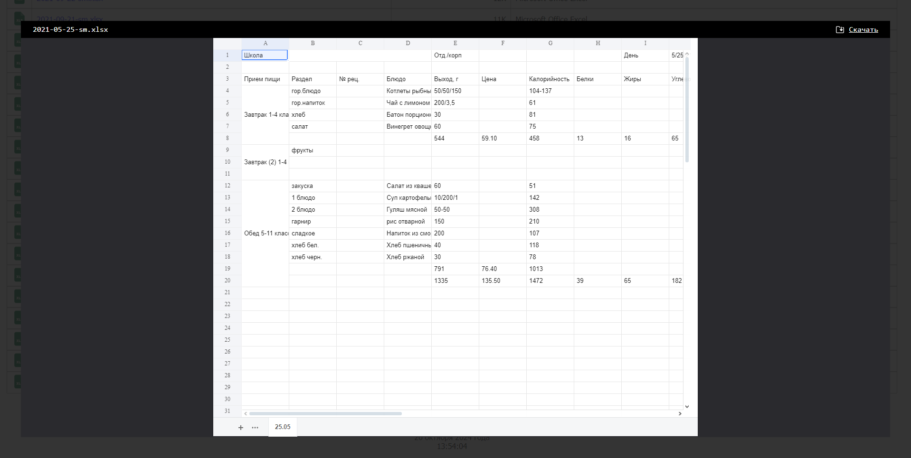

# Директория `food`

Директории `food` и `food-individual` размещается в корне сайта школы для вывода `xlsx` файлов питания в `food`, и `pdf` файлов в `food-individual`.

Поддержка предпросмотра файлов `xlsx`, `docx` и `pdf`

Дтректории `icons-full` и `viewer` так же размещзаются в корне сайта.

В настройках доменного имени (ISP хостинга расположения сайта) должно быть обязательно включено SSI (обработка SSI (server side includes) web-сервером)

## ВИД ДИРЕКТОРИИ

## ПРЕДПРОСМОТР ФАЙЛА

### БОНУС

Плагин `jquery.fancybox` также имеет поддержку просмотра видео с [RuTube](https://rutube.ru/channel/25773334/videos/)
